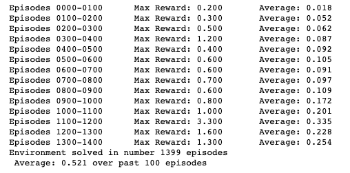
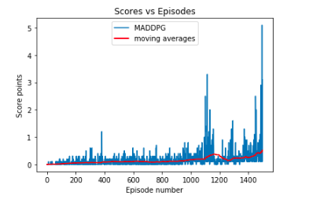

# Report Document

## Project 3: Multi-Agent Collaboration & Competition (Deep Reinforcement Learning Nanodegree)

### Project's Goal

For this project, I work with the similar, but not identical to the [Tennis](https://github.com/Unity-Technologies/ml-agents/blob/master/docs/Learning-Environment-Examples.md#tennis) environment on the Unity ML-Agents GitHub page.

The agents must bounce ball between one another while not dropping or sending ball out of bounds.


### Environment's Summary

Two agents control rackets to bounce a ball over a net. If an agent hits the ball over the net, it receives a reward of +0.1. If an agent lets a ball hit the ground or hits the ball out of bounds, it receives a reward of -0.01. Thus, the goal of each agent is to keep the ball in play.

The observation space consists of 8 variables corresponding to the position and velocity of the ball and racket. Each agent receives its own, local observation. Two continuous actions are available, corresponding to movement toward (or away from) the net, and jumping.

The task is episodic, and in order to solve the environment, the agents must get an average score of +0.5 (over 100 consecutive episodes, after taking the maximum over both agents). Specifically,

After each episode, we add up the rewards that each agent received (without discounting), to get a score for each agent. This yields 2 (potentially different) scores. We then take the maximum of these 2 scores.
This yields a single score for each episode.
The environment is considered solved, when the average (over 100 episodes) of those scores is at least +0.5.

### Learning Algorithm
### Multi-Agent Deep Deterministic Policy Gradient (MADDPG)

MADDPG extends the principles of another reinforcement learning algorithm called DDPG to multi-agent settings, the OpenAI algorithm allow agents to learn from their own actions as well as the actions of other agents in the environment. More details can found in the in this [paper](https://papers.nips.cc/paper/7217-multi-agent-actor-critic-for-mixed-cooperative-competitive-environments.pdf), Multi-Agent Actor-Critic for Mixed Cooperative-Competitive Environments, by Lowe and Wu, along with other researchers from OpenAI, UC Berkeley, and McGill University

### Hyper Parameters
```
BUFFER_SIZE = int(1e6)  # replay buffer size
BATCH_SIZE = 128        # minibatch size
LR_ACTOR = 1e-3         # learning rate of the actor
LR_CRITIC = 1e-3        # learning rate of the critic
WEIGHT_DECAY = 0        # L2 weight decay
LEARN_EVERY = 1         # learning timestep interval
LEARN_NUM = 5           # number of learning passes
GAMMA = 0.99            # discount factor
TAU = 8e-3              # for soft update of target parameters
OU_SIGMA = 0.2          # Ornstein-Uhlenbeck noise parameter, volatility
OU_THETA = 0.15         # Ornstein-Uhlenbeck noise parameter, speed of mean reversion
EPS_START = 5.0         # initial value for epsilon in noise decay process in Agent.act()
EPS_EP_END = 300        # episode to end the noise decay process
EPS_FINAL = 0           # final value for epsilon after decay
```

### Actor-Critic Method

**First let's talk about DDPG Actor-Critic Method.**

The DDPG algorithm uses a **Actor-Critic Method**. In detail, the replay buffer takes a series of experiences to update the weights of the critical model. In turn, the critical model will use this information to predict the actions of subsequent states given by the actor's model. In this way, by applying the Bellman equation the target values ​​are calculated, after having calculated the loss the model itself is updated trying to minimize it. In the meantime, the actor's model uses the output of the critical model to calculate its Q values ​​and current states to predict actions. Both models outputs are used to update the models. As mentioned in the paper linked above, the agent is given an Ornstein-Uhlenbeck trial in order to balance the continuous exploitation of space. Consequently to this process there is the addition of noise based on the parameters entered.

**MADDPG**

Traditional actor-critic methods have a separate critic for each agent, instead **MADDPG** utilizes a single critic that receives as input the actions and state observations from all agents, making the training simpler and allowing centralized training with decentralized execution.


```
# Actor Network (w/ Target Network)
self.actor_local = Actor(state_size, action_size, random_seed).to(device)
self.actor_target = Actor(state_size, action_size, random_seed).to(device)
self.actor_optimizer = optim.Adam(self.actor_local.parameters(), lr=LR_ACTOR)

# Critic Network (w/ Target Network)
self.critic_local = Critic(state_size, action_size, random_seed).to(device)
self.critic_target = Critic(state_size, action_size, random_seed).to(device)
self.critic_optimizer = optim.Adam(self.critic_local.parameters(), lr=LR_CRITIC, weight_decay=WEIGHT_DECAY)
```

### Actor Model

```
"""Actor (Policy) Model."""

    def __init__(self, state_size, action_size, seed, fc1_units=256, fc2_units=128):
        """Initialize parameters and build model.
        Params
        ======
            state_size (int): Dimension of each state
            action_size (int): Dimension of each action
            seed (int): Random seed
            fc1_units (int): Number of nodes in first hidden layer
            fc2_units (int): Number of nodes in second hidden layer
        """
        super(Actor, self).__init__()
        self.seed = torch.manual_seed(seed)
        self.fc1 = nn.Linear(state_size*2, fc1_units)
        self.fc2 = nn.Linear(fc1_units, fc2_units)
        self.fc3 = nn.Linear(fc2_units, action_size)
        self.reset_parameters()

    def reset_parameters(self):
        self.fc1.weight.data.uniform_(*hidden_init(self.fc1))
        self.fc2.weight.data.uniform_(*hidden_init(self.fc2))
        self.fc3.weight.data.uniform_(-3e-3, 3e-3)

    def forward(self, state):
        """Build an actor (policy) network that maps states -> actions."""
        x = F.relu(self.fc1(state))
        x = F.relu(self.fc2(x))
        return torch.tanh(self.fc3(x))
```


### Critic model

```
class Critic(nn.Module):
    """Critic (Value) Model."""

    def __init__(self, state_size, action_size, seed, fcs1_units=256, fc2_units=128):
        """Initialize parameters and build model.
        Params
        ======
            state_size (int): Dimension of each state
            action_size (int): Dimension of each action
            seed (int): Random seed
            fcs1_units (int): Number of nodes in the first hidden layer
            fc2_units (int): Number of nodes in the second hidden layer
        """
        super(Critic, self).__init__()
        self.seed = torch.manual_seed(seed)
        self.fcs1 = nn.Linear(state_size*2, fcs1_units)
        self.fc2 = nn.Linear(fcs1_units+(action_size*2), fc2_units)
        self.fc3 = nn.Linear(fc2_units, 1)
        self.reset_parameters()

    def reset_parameters(self):
        self.fcs1.weight.data.uniform_(*hidden_init(self.fcs1))
        self.fc2.weight.data.uniform_(*hidden_init(self.fc2))
        self.fc3.weight.data.uniform_(-3e-3, 3e-3)

    def forward(self, state, action):
        """Build a critic (value) network that maps (state, action) pairs -> Q-values."""
        xs = F.relu(self.fcs1(state))
        x = torch.cat((xs, action), dim=1)
        x = F.relu(self.fc2(x))
        return self.fc3(x)
```

### Results

Setting the parameters as described above, the environment is solved in 1399 episodes, with an average of 0.521 over past 100 episodes.





To know more about how I solved the environment you can take a look at the Jupyter Notebook included in this repository.

### Future Improvements
* Experience Reply: Prioritize replay selects experiences based on a priority value in correlation with the size of the of error. In this way we can improve learning by increasing the probability that salient experience vectors will be sampled.

* Batch Normalization: Batch normalization can improve the learning speed and stability by scaling the features in order to be within the same range throughout the model and different environments.
